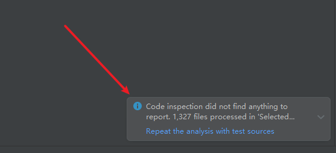

一个基于spring boot、spring oauth2.0、mybatis、redis的轻量级、前后端分离、防范xss攻击、拥有分布式锁，为生产环境多实例完全准备，数据库为b2b2c设计，拥有完整sku和下单流程的完全开源商城

## 前言

`Mall4j`项目致力于为中小企业打造一个完整、易于维护的开源的电商系统，采用现阶段流行技术实现。后台管理系统包含商品管理、订单管理、运费模板、规格管理、会员管理、运营管理、内容管理、统计报表、权限管理、设置等模块。

## 文档

这代码有没有文档呀？ 当然有啦，你已经下载了，在doc这个文件夹上，实在不知道，我就给链接出来咯：

gitee：https://gitee.com/gz-yami/mall4j/tree/master/doc

看云：https://www.kancloud.cn/yami/mall4j

**开发环境搭建视频（推荐先看下文档再看视频）：https://www.bilibili.com/video/BV1eW4y1V7c1** 

有声音了。如果视频对你有用，记得点赞投币噢。

## 授权

除了开源版本，我们商业版有B2C和B2B2C商城，多端呈现：小程序 + PC + H5 + APP，更多详情请查看官网 

Mall4j官网 https://www.mall4j.com

Mall4j 使用 AGPLv3 开源，请遵守 AGPLv3 的相关条款，或者联系作者获取商业授权(https://www.mall4j.com)

## 项目链接

java后台：https://gitee.com/gz-yami/mall4j

vue后台前端：https://gitee.com/gz-yami/mall4v

小程序：https://gitee.com/gz-yami/mall4m

uni-app：https://gitee.com/gz-yami/mall4uni

## 演示地址

 商业版小程序演示

## 技术选型

| 技术                  | 版本      | 说明                           |
|---------------------|---------|------------------------------|
| Spring Boot         | 3.0.4   | MVC核心框架                      |
| Spring Security web | 3.0.4   | web应用安全防护                    |
| satoken             | 1.34.0  | 一个轻量级 Java 权限认证框架，取代spring oauth2 |
| MyBatis             | 3.5.10  | ORM框架                        |
| MyBatisPlus         | 3.5.3.1 | 基于mybatis，使用lambda表达式的       |
| spring-doc          | 2.0.0   | 接口文档工具                       |
| jakarta-validation  | 3.0.2   | 验证框架                         |
| redisson            | 3.19.3  | 对redis进行封装、集成分布式锁等           |
| hikari              | 5.0.1   | 数据库连接池                       |
| logback             | 1.4.5   | log日志工具                      |
| lombok              | 1.18.26 | 简化对象封装工具                     |
| hutool              | 5.8.15  | 更适合国人的java工具集                |
| knife4j             | 4.0.0   | 基于swagger，更便于国人使用的swagger ui |

通过阿里的代码规范扫描工具（Alibaba Java Coding Guidelines plugin），扫描无异常：

## 部署教程

ps: 如果你不清楚如何启动我们的商城，请仔细阅wiki当中的文档

https://gitee.com/gz-yami/mall4j/wikis

**开发环境搭建视频（推荐先看下文档再看视频）：https://www.bilibili.com/video/BV1eW4y1V7c1** 

有声音了。如果视频对你有用，记得点赞投币噢。

## 相关截图

 

### 1. 后台截图

### 2. 移动端截图

## 提交反馈
- Mall4j官网 https://www.mall4j.com

- Mall4j官方技术QQ 1群：722835385（3000人群已满）
- Mall4j官方技术QQ 2群：729888395
- 如需购买商业版源码，请联系商务微信

  

## 特别鸣谢

- wxjava: https://github.com/Wechat-Group/WxJava
- sa-token: https://gitee.com/dromara/sa-token

## mall4cloud微服务版本已上线
https://gitee.com/gz-yami/mall4cloud

## 更多信息请查看官网 <https://www.mall4j.com>
