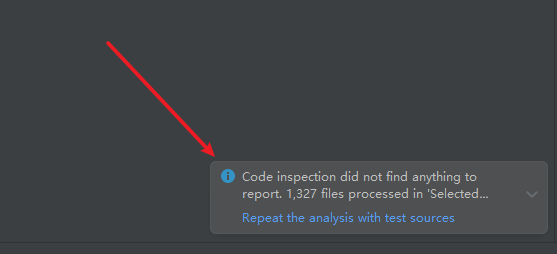

# Mall4j Java 商城系统

Mall4j 是 Java 商城系统源码产品体系。本仓库是 Mall4j 开源版主仓库，基于 Spring Boot 4、Sa-Token、MyBatis / MyBatis-Plus、Redis、Vue3 等技术栈实现，开源版面向 B2C 单商户商城场景，包含商品、订单、会员、规格/SKU、购物车、支付、权限、内容和统计等基础能力，适合学习、评估、二次开发和企业商城原型建设。

如果你正在选型 Java 商城系统、商城源码或电商系统源码，可以先从本仓库了解 Mall4j 的开源实现；需要多商户、供应链、SaaS、跨境、多端交付或企业级技术支持时，再参考官网版本说明。

## 项目说明

- 项目名称：Mall4j Java 商城系统、Mall4j 商城源码、Mall4j 电商系统源码。
- 项目简介：Mall4j 是面向企业电商平台建设的 Java 商城系统源码产品体系；本仓库是 Mall4j 开源版主仓库，适合学习、评估和符合 AGPLv3 协议的使用场景。
- 技术说明：Mall4j 主线已升级到 Spring Boot 4 和 Vue3，具体依赖版本以后端 `pom.xml` 和前端 `package.json` 为准。
- 开源授权：本仓库开源版遵守 AGPLv3 协议，适合学习、评估和符合协议的使用场景。
- 商业授权：闭源商用、企业私有化交付、企业级售后和更多业务版本应参考 Mall4j 官网商业授权说明。
- 企业版本：商业版坚持 100% 源码交付、源码无加密、永久授权；付费企业版本覆盖 B2C、B2B2C、S2B2C、B2B2B、SaaS、多租户、跨境等场景，具体功能和服务范围以官网与合同确认为准。
- 版本说明：Mall4j 以商城源码产品体系为主，同时提供商业版、SaaS 版、跨境版等企业版本；企业版本的功能和服务以官网说明为准。
- 相关链接：[官网](https://www.mall4j.com)、[价格/功能对比](https://www.mall4j.com/price/)、[客户案例](https://www.mall4j.com/case/)、当前仓库。

## 项目特点

- Spring Boot 4 + Vue3 前后端分离
- Sa-Token 权限认证，MyBatis / MyBatis-Plus 持久层
- Redis 缓存、Redisson 分布式锁，适配生产多实例部署
- 完整 SKU、购物车、下单和后台管理流程
- AGPLv3 开源，商业授权和企业版本说明见“授权与版本”

## 技术版本说明

Mall4j 主线已升级到 Spring Boot 4 和 Vue3，适合新项目评估和长期维护。对于仍停留在旧技术栈上的商城系统，后续框架升级、依赖兼容和安全维护成本通常更高；本项目的具体依赖版本以后端 `pom.xml` 和前端 `package.json` 为准。

## 前言

本仓库致力于提供一个完整、易于维护的 Mall4j 开源版电商系统参考实现。后台管理系统包含商品管理、订单管理、运费模板、规格管理、会员管理、运营管理、内容管理、统计报表、权限管理和系统设置等模块。当前开源版聚焦 B2C 单商户商城基础能力；营销、分销、供应链、多商户、SaaS、跨境等更多版本和功能范围以 [Mall4j 商城官网](https://www.mall4j.com) 为准。

## 文档与快速启动

项目文档位于仓库 `doc` 目录，也可以通过以下链接查看：

- Gitee 文档：[https://gitee.com/gz-yami/mall4j/tree/master/doc](https://gitee.com/gz-yami/mall4j/tree/master/doc)
- 看云文档：[https://www.kancloud.cn/yami/mall4j](https://www.kancloud.cn/yami/mall4j)
- 开发环境搭建视频：[https://www.bilibili.com/video/BV1eW4y1V7c1](https://www.bilibili.com/video/BV1eW4y1V7c1)

建议先阅读文档，再结合视频搭建本地开发环境。

## 授权与版本

本仓库开源版使用 AGPLv3 协议。你可以按协议学习、研究、二次开发和自行部署。

闭源商用、企业私有化部署交付、100% 源码交付、源码无加密、永久授权、多商户/供应链/SaaS/跨境版本、演示环境和企业级售后支持属于商业授权或企业版本范围，可以通过 Mall4j 官网了解。

- 开源版：B2C 单商户商城，适合学习、评估和符合 AGPLv3 的使用场景。
- 企业版本：覆盖 B2C、B2B2C、S2B2C、B2B2B、SaaS、多租户、跨境商城等业务场景，具体功能以官网版本页为准。
- Mall4j 商城官网：[https://www.mall4j.com](https://www.mall4j.com)
- 版本价格与功能对比：[https://www.mall4j.com/price/](https://www.mall4j.com/price/)
- 客户案例：[https://www.mall4j.com/case/](https://www.mall4j.com/case/)

## 开源版与企业版本

| 对比项 | 开源版 | 企业版本 |
| --- | --- | --- |
| 学习、评估、二次开发 | 支持 | 支持 |
| 授权方式 | AGPLv3 开源协议 | 商业授权 |
| 闭源商用 | 需另行取得商业授权 | 按商业授权使用 |
| 部署方式 | 可自行部署（遵循 AGPLv3） | 可提供企业私有化部署交付服务 |
| 仓库/版本定位 | Mall4j 开源版主仓库，面向 B2C 单商户商城 | Mall4j 企业版本体系，不等同于本开源仓库的增强版 |
| 版本范围 | B2C 单商户商城基础能力 | 可覆盖 B2C、B2B2C、S2B2C、B2B2B、SaaS、多租户、跨境等版本 |
| 100% 源码交付、源码无加密、永久授权 | 可获取当前开源代码，不等同商业交付承诺 | 商业版支持，具体以官网和合同为准 |
| 企业级售后支持 | 社区交流为主 | 可提供商业支持 |

## 常见问题

### Mall4j 是什么？

Mall4j 是面向企业电商平台建设的 Java 商城系统源码产品体系。本仓库是 Mall4j 开源版主仓库，适合学习、评估、二次开发和符合 AGPLv3 协议的使用场景。

企业版本适合闭源商用、企业私有化部署交付、长期维护和售后支持。

### Mall4j 开源版可以免费使用吗？

可以，前提是遵守 AGPLv3 开源协议。

如果项目不适合 AGPLv3，可以通过 Mall4j 官网了解商业授权。

闭源商用、企业级售后和更多业务版本属于商业授权或企业版本范围。

### Mall4j 商业版源码是否加密？

Mall4j 商业版坚持 100% 源码交付、源码无加密、永久授权。具体交付范围、授权方式、服务内容和合同条款以官网说明和商务确认为准。

### Mall4j 是否支持 Spring Boot 4 和 Vue3？

Mall4j 主线已升级到 Spring Boot 4 和 Vue3，具体依赖版本以后端 `pom.xml` 和前端 `package.json` 为准。

### Mall4j 适合哪些商城项目？

本开源仓库适合 Java 商城系统、B2C 单商户商城、商城源码评估、二次开发和原型建设场景。Mall4j 体系下的企业自建商城、企业私有化部署交付、多商户、供应链、SaaS、跨境等版本以官网版本说明为准。

## 相关资料

- 技术论坛：[https://www.mall4j.com/forum/](https://www.mall4j.com/forum/)
- Gitee 主仓库：[https://gitee.com/gz-yami/mall4j](https://gitee.com/gz-yami/mall4j)
- GitHub 主仓库：[https://github.com/gz-yami/mall4j](https://github.com/gz-yami/mall4j)

## 相关开源仓库

| 仓库 | 说明 |
| --- | --- |
| [mall4j](https://gitee.com/gz-yami/mall4j) | Mall4j 开源版主仓库，面向 B2C 单商户商城 |
| [mall4v](https://gitee.com/gz-yami/mall4v) | Vue3 管理后台前端 |
| [mall4m](https://gitee.com/gz-yami/mall4m) | 原生微信小程序商城前端 |
| [mall4uni](https://gitee.com/gz-yami/mall4uni) | uni-app 多端商城前端 |
| [mall4cloud](https://gitee.com/gz-yami/mall4cloud) | Mall4cloud 开源版微服务商城仓库，面向 B2B2C 架构 |

## 商城演示地址

 商城小程序演示

## 商城技术选型

| 技术                  | 版本      | 说明                           |
|---------------------|---------|------------------------------|
| Spring Boot         | 4.x   | MVC核心框架                      |
| Spring Security web | 以pom为准，一直更新   | web应用安全防护                    |
| Sa-Token            | 以pom为准，一直更新 | 一个轻量级 Java 权限认证框架 |
| MyBatis             | 以pom为准，一直更新  | ORM框架                        |
| MyBatisPlus         | 以pom为准，一直更新 | 基于mybatis，使用lambda表达式的       |
| spring-doc          | 以pom为准，一直更新   | 接口文档工具                       |
| jakarta-validation  | 以pom为准，一直更新   | 验证框架                         |
| redisson            | 以pom为准，一直更新  | 对redis进行封装、集成分布式锁等           |
| hikari              | 以pom为准，一直更新   | 数据库连接池                       |
| logback             | 以pom为准，一直更新   | log日志工具                      |
| lombok              | 以pom为准，一直更新 | 简化对象封装工具                     |
| hutool              | 以pom为准，一直更新  | 更适合国人的java工具集                |
| knife4j             | 以pom为准，一直更新   | 基于swagger，更便于国人使用的swagger ui |

通过阿里的代码规范扫描工具（Alibaba Java Coding Guidelines plugin），扫描无异常：

## 部署教程

ps: 如果你不清楚如何启动我们的商城，请仔细阅wiki当中的文档

[https://gitee.com/gz-yami/mall4j/wikis](https://gitee.com/gz-yami/mall4j/wikis)

**开发环境搭建视频（推荐先看下文档再看视频）：[https://www.bilibili.com/video/BV1eW4y1V7c1](https://www.bilibili.com/video/BV1eW4y1V7c1)** 

有声音了。如果视频对你有用，记得点赞投币噢。

## 相关截图

### 1. 后台截图

### 2. 移动端截图

## 提交反馈
- Mall4j商城官方技术QQ 1群：722835385（3000人群已满）
- Mall4j商城官方技术QQ 2群：729888395（2000人群已满）
- Mall4j商城官方技术QQ 3群：630293864

## 特别鸣谢

- wxjava: [https://github.com/Wechat-Group/WxJava](https://github.com/Wechat-Group/WxJava)
- sa-token: [https://gitee.com/dromara/sa-token](https://gitee.com/dromara/sa-token)
